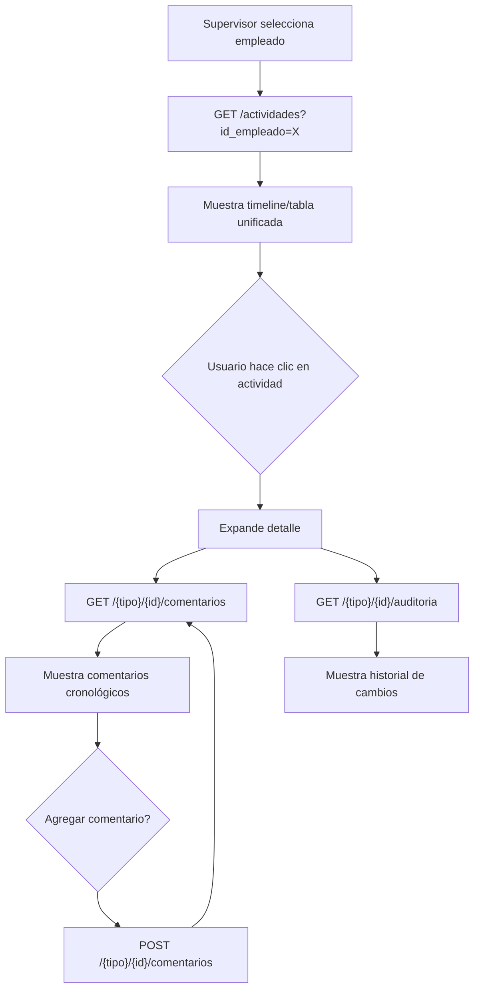

# Informe Backend → Frontend: Historial de Actividades

> **Branch:** `feat/historial-actividades` · **PR:** #16  
> **Fecha:** 2026-09-08  
> **Base URL:** `/api/v1`

---

## 1. Resumen ejecutivo

Se implementó una **vista unificada de actividades** (tareas + eventos) por empleado, con tres capacidades nuevas:

1. **Historial unificado** — Un listado paginado que combina tareas y eventos de un empleado, con filtros por fecha, tipo, empresa y oportunidad.
2. **Comentarios de seguimiento** — Notas append-only sobre cualquier actividad (tarea o evento). Nunca sobrescriben la descripción.
3. **Auditoría de ediciones** — Registro campo a campo de cada edición sobre una tarea o evento (quién cambió qué, cuándo, valor anterior y nuevo).

### ¿A quién va dirigida esta vista?

Principalmente a **admin, gerencia y jdv** (roles supervisores). Un vendedor/analista solo puede ver su propio historial. Si intenta ver el de otro empleado, recibe `403`.

---

## 2. Nuevos endpoints

Se crearon **4 endpoints** bajo `/api/v1/actividades`:

| # | Método | Ruta | Descripción |
|---|--------|------|-------------|
| 1 | `GET` | `/actividades` | Historial unificado de un empleado |
| 2 | `GET` | `/actividades/{tipo}/{id}/comentarios` | Comentarios de una actividad |
| 3 | `POST` | `/actividades/{tipo}/{id}/comentarios` | Crear un comentario |
| 4 | `GET` | `/actividades/{tipo}/{id}/auditoria` | Historial de ediciones de una actividad |

> [!IMPORTANT]
> En todas las rutas, `{tipo}` es **siempre** `tarea` o `evento` (minúsculas, singular). Cualquier otro valor devuelve `400 VALIDACION_ERROR`.

---

## 3. Endpoint 1: Historial unificado

### Request

```
GET /api/v1/actividades?id_empleado=7&desde=2026-09-01T00:00:00Z&hasta=2026-09-30T23:59:59Z&tipo=tarea&id_empresa=3&id_oportunidad=20&page=1&per_page=20
```

| Query param | Tipo | Requerido | Descripción |
|---|---|---|---|
| `id_empleado` | `Long` | **Sí** | ID del empleado cuyo historial se consulta |
| `desde` | `Instant` (ISO 8601) | No | Filtro por `created_at >= desde` |
| `hasta` | `Instant` (ISO 8601) | No | Filtro por `created_at <= hasta` |
| `tipo` | `String` | No | `tarea`, `evento`, o vacío para ambos |
| `id_empresa` | `Long` | No | Solo actividades vinculadas a esta empresa |
| `id_oportunidad` | `Long` | No | Solo actividades vinculadas a esta oportunidad |
| `page` | `Int` | No | Página (1-based). Default: `1` |
| `per_page` | `Int` | No | Elementos por página. Default: `20`, máximo: `100` |

> [!NOTE]
> `desde` y `hasta` filtran por **`created_at`** (cuándo se creó la actividad), NO por la fecha planificada (fecha de ejecución o fecha estimada). Ambos son instantes UTC en formato ISO 8601.

### Response — Éxito (`200`)

```jsonc
{
  "data": [
    {
      "tipo": "tarea",           // "tarea" | "evento"
      "id": 42,
      "titulo": "llamada",       // tipo_accion de la tarea, o nombre del evento
      "descripcion": "Llamar al contacto para seguimiento",
      "estado": "pendiente",     // estado_accion de tarea, o estado de evento
      "fecha_hora": "2026-09-10T15:00:00Z",  // Instant | null — TIMESTAMP (fecha_ejecucion de tarea, fecha_ocurrencia de evento)
      "fecha_dia": null,         // LocalDate | null — DATE (fecha_estimada de evento; siempre null para tareas)
      "id_empresa": 3,
      "empresa": {               // null si no se pudo resolver
        "id": 3,
        "razon_social": "ACME SAC",
        "distrito": "Miraflores"
      },
      "id_oportunidad": 20,      // null para tareas de prospección
      "id_empleado": 7,          // id_asignado de tarea, o created_by de evento
      "empleado": {              // null si no se pudo resolver
        "id": 7,
        "nombres": "Juan",
        "apellidos": "Pérez"
      },
      "comentarios": 3,          // número total de comentarios de seguimiento
      "created_at": "2026-09-01T10:00:00Z"
    },
    {
      "tipo": "evento",
      "id": 15,
      "titulo": "Visita a planta",
      "descripcion": null,
      "estado": "pendiente",
      "fecha_hora": null,                 // fecha_ocurrencia, null si aún no ocurrió
      "fecha_dia": "2026-09-15",          // fecha_estimada (solo para eventos)
      "id_empresa": null,
      "empresa": null,
      "id_oportunidad": 20,
      "id_empleado": 7,
      "empleado": {
        "id": 7,
        "nombres": "Juan",
        "apellidos": "Pérez"
      },
      "comentarios": 0,
      "created_at": "2026-09-02T14:30:00Z"
    }
  ],
  "meta": {
    "page": 1,
    "per_page": 20,
    "total": 47,
    "total_pages": 3
  },
  "error": null
}
```

> [!WARNING]
> **Dos campos de fecha separados — por diseño.** `fecha_hora` es un `Instant` (para columnas TIMESTAMP como `fecha_ejecucion` y `fecha_ocurrencia`). `fecha_dia` es un `LocalDate` (para columnas DATE como `fecha_estimada`). **Nunca** unifiques estos campos en un solo `Date` en el frontend: mezclarlos introduciría desfases de zona horaria. Para tareas, `fecha_dia` es **siempre** `null`. Para eventos, `fecha_hora` puede ser `null` (si aún no ocurrió) y `fecha_dia` puede tener valor (la fecha estimada).

### Response — Errores

| Código HTTP | `error.code` | Cuándo |
|---|---|---|
| `400` | `VALIDACION_ERROR` | `tipo` no es `tarea` ni `evento` |
| `401` | `NO_AUTENTICADO` | No hay token válido |
| `403` | `PERMISO_INSUFICIENTE` | Un no-supervisor pide el historial de otro empleado |

---

## 4. Endpoint 2: Listar comentarios

### Request

```
GET /api/v1/actividades/tarea/42/comentarios
GET /api/v1/actividades/evento/15/comentarios
```

No tiene query params.

### Response — Éxito (`200`)

```jsonc
{
  "data": [
    {
      "id": 1,
      "tipo": "tarea",            // "tarea" | "evento"
      "id_actividad": 42,         // id de la tarea o evento al que pertenece
      "texto": "Se habló con el contacto, pide cotización.",
      "created_at": "2026-09-05T09:30:00Z",
      "created_by": 7,            // id del empleado que escribió el comentario
      "autor": {
        "id": 7,
        "nombres": "Juan",
        "apellidos": "Pérez"
      }
    },
    {
      "id": 2,
      "tipo": "tarea",
      "id_actividad": 42,
      "texto": "Cotización enviada por email.",
      "created_at": "2026-09-06T11:00:00Z",
      "created_by": 1,
      "autor": {
        "id": 1,
        "nombres": "Admin",
        "apellidos": "Sistema"
      }
    }
  ],
  "meta": null,
  "error": null
}
```

> [!NOTE]
> Los comentarios se devuelven ordenados cronológicamente (del más antiguo al más reciente). **No hay paginación** en este endpoint; se devuelven todos los comentarios de la actividad.

### Response — Errores

| Código HTTP | `error.code` | Cuándo |
|---|---|---|
| `400` | `VALIDACION_ERROR` | `tipo` no es `tarea` ni `evento` |
| `404` | `NO_ENCONTRADO` | La tarea/evento no existe o el usuario no tiene visibilidad |

---

## 5. Endpoint 3: Crear comentario

### Request

```
POST /api/v1/actividades/tarea/42/comentarios
Content-Type: application/json
```

```json
{
  "texto": "Se habló con el contacto, pide cotización."
}
```

| Campo | Tipo | Requerido | Validación |
|---|---|---|---|
| `texto` | `String` | **Sí** | No vacío, máximo 5000 caracteres. Se aplica `trim()`. |

### Response — Éxito (`201 Created`)

```jsonc
{
  "data": {
    "id": 5,
    "tipo": "tarea",
    "id_actividad": 42,
    "texto": "Se habló con el contacto, pide cotización.",
    "created_at": "2026-09-08T10:00:00Z",
    "created_by": 7,
    "autor": {
      "id": 7,
      "nombres": "Juan",
      "apellidos": "Pérez"
    }
  },
  "meta": null,
  "error": null
}
```

> [!IMPORTANT]
> El `created_by` se toma del token JWT del usuario autenticado. No se envía en el body.

### Response — Errores

| Código HTTP | `error.code` | Cuándo |
|---|---|---|
| `400` | `VALIDACION_ERROR` | `tipo` inválido, `texto` vacío, o supera 5000 chars |
| `404` | `NO_ENCONTRADO` | La tarea/evento no existe o el usuario no tiene visibilidad |

---

## 6. Endpoint 4: Auditoría de ediciones

### Request

```
GET /api/v1/actividades/tarea/42/auditoria
GET /api/v1/actividades/evento/15/auditoria
```

No tiene query params.

### Response — Éxito (`200`)

```jsonc
{
  "data": [
    {
      "id": 10,
      "campo": "descripcion",           // nombre del campo en snake_case
      "valor_anterior": "Llamar mañana",
      "valor_nuevo": "Llamar hoy urgente",
      "changed_at": "2026-09-07T16:00:00Z",
      "changed_by": 1,
      "autor": {
        "id": 1,
        "nombres": "Admin",
        "apellidos": "Sistema"
      }
    },
    {
      "id": 9,
      "campo": "fecha_ejecucion",
      "valor_anterior": "2026-09-10T15:00:00Z",
      "valor_nuevo": "2026-09-08T10:00:00Z",
      "changed_at": "2026-09-07T15:55:00Z",
      "changed_by": 1,
      "autor": {
        "id": 1,
        "nombres": "Admin",
        "apellidos": "Sistema"
      }
    },
    {
      "id": 8,
      "campo": "id_asignado",
      "valor_anterior": "7",
      "valor_nuevo": "12",
      "changed_at": "2026-09-06T09:00:00Z",
      "changed_by": 1,
      "autor": {
        "id": 1,
        "nombres": "Admin",
        "apellidos": "Sistema"
      }
    }
  ],
  "meta": null,
  "error": null
}
```

> [!NOTE]
> Los cambios se devuelven del **más reciente al más antiguo**. `valor_anterior` y `valor_nuevo` siempre son `String` (o `null` si el campo no tenía valor previo / se borró). Los nombres de campo son los del contrato de API en `snake_case`, no los internos de Kotlin.

### Campos que se auditan

#### Tareas
Los campos que se comparan al editar una tarea (en `TareaServiceImpl.actualizar`):
- `tipo_accion`
- `descripcion`
- `fecha_ejecucion`
- `id_contacto`
- `id_asignado`

#### Eventos
Los campos que se comparan al editar un evento (en `EventoServiceImpl.actualizar`):
- `fecha_estimada`
- `fecha_seguimiento`
- `descripcion`

### Response — Errores

| Código HTTP | `error.code` | Cuándo |
|---|---|---|
| `400` | `VALIDACION_ERROR` | `tipo` no es `tarea` ni `evento` |
| `404` | `NO_ENCONTRADO` | La tarea/evento no existe o el usuario no tiene visibilidad |

---

## 7. Permisos detallados

### Historial (`GET /actividades`)

```
Si id_empleado == usuario_actual.id → cualquier rol autenticado puede ver su propio historial
Si id_empleado != usuario_actual.id → solo admin, gerencia, jdv (supervisores)
   Si no es supervisor → 403 PERMISO_INSUFICIENTE
```

### Comentarios y auditoría

Delegan la visibilidad al módulo dueño de la actividad:
- Para `tarea`: usa la misma regla de visibilidad que `GET /tareas/:id`
- Para `evento`: usa la misma regla de visibilidad que `GET /eventos/:id`
- Si el usuario no puede ver la actividad → `404 NO_ENCONTRADO`

---

## 8. Estructura completa de tipos (TypeScript equivalente)

Para facilitar la implementación en el frontend, aquí están los tipos equivalentes:

```typescript
// ═══════════════════════════════════════════════
// Tipos base reutilizados (ya deberían existir)
// ═══════════════════════════════════════════════

interface EmpleadoResumen {
  id: number;
  nombres: string;
  apellidos: string;
}

interface EmpresaResumen {
  id: number;
  razon_social: string;
  distrito: string | null;
}

interface PageMeta {
  page: number;
  per_page: number;
  total: number;
  total_pages: number;
}

interface ApiResponse<T> {
  data: T | null;
  meta: PageMeta | null;   // solo presente en endpoints paginados
  error: ApiError | null;
}

interface ApiError {
  code: string;
  message: string;
  field?: string;
}

// ═══════════════════════════════════════════════
// Tipos nuevos del módulo actividades
// ═══════════════════════════════════════════════

type TipoActividad = 'tarea' | 'evento';

/** Una actividad en el historial unificado */
interface ActividadDto {
  tipo: TipoActividad;
  id: number;
  titulo: string;           // tipo_accion (tarea) o nombre del evento
  descripcion: string | null;
  estado: string;            // estado_accion (tarea) o estado (evento)
  fecha_hora: string | null; // ISO 8601 Instant — TIMESTAMP columns only
  fecha_dia: string | null;  // ISO 8601 Date "YYYY-MM-DD" — DATE columns only
  id_empresa: number | null;
  empresa: EmpresaResumen | null;
  id_oportunidad: number | null;
  id_empleado: number | null;  // id_asignado (tarea) o created_by (evento)
  empleado: EmpleadoResumen | null;
  comentarios: number;        // count of follow-up comments
  created_at: string;         // ISO 8601 Instant — when the activity was created
}

/** Filtros del historial (query params) */
interface HistorialFiltros {
  id_empleado: number;       // REQUIRED
  desde?: string;            // ISO 8601 Instant
  hasta?: string;            // ISO 8601 Instant
  tipo?: TipoActividad;
  id_empresa?: number;
  id_oportunidad?: number;
  page?: number;
  per_page?: number;
}

/** Un comentario de seguimiento */
interface ComentarioDto {
  id: number;
  tipo: TipoActividad;
  id_actividad: number;
  texto: string;
  created_at: string;      // ISO 8601 Instant
  created_by: number;
  autor: EmpleadoResumen | null;
}

/** Body para crear un comentario */
interface CrearComentarioRequest {
  texto: string;            // 1–5000 chars, trimmed by backend
}

/** Una entrada de auditoría (cambio de campo) */
interface CambioAuditoriaDto {
  id: number;
  campo: string;             // nombre del campo en snake_case
  valor_anterior: string | null;
  valor_nuevo: string | null;
  changed_at: string;        // ISO 8601 Instant
  changed_by: number;
  autor: EmpleadoResumen | null;
}
```

---

## 9. Orden de los datos

| Endpoint | Orden |
|---|---|
| `GET /actividades` | `created_at DESC` (más reciente primero) |
| `GET /{tipo}/{id}/comentarios` | `created_at ASC` (más antiguo primero = cronológico) |
| `GET /{tipo}/{id}/auditoria` | `changed_at DESC` (cambio más reciente primero) |

---

## 10. Envelope de respuesta

Todos los endpoints siguen el envelope estándar de la API:

```json
{
  "data": "...",
  "meta": "...",
  "error": null
}
```

- En **éxito**: `data` contiene el resultado, `error` es `null`.
- En **error**: `data` es `null`, `error` contiene `{ code, message, field? }`.
- `meta` solo tiene valor en el historial (`GET /actividades`) con la paginación.

---

## 11. Tablas de base de datos creadas

### `actividad_comentarios` (V48)

| Columna | Tipo | Notas |
|---|---|---|
| `id` | `BIGSERIAL PK` | Auto-incrementado |
| `id_tarea` | `BIGINT FK → tareas(id)` | Nullable, `ON DELETE CASCADE` |
| `id_evento` | `BIGINT FK → eventos(id)` | Nullable, `ON DELETE CASCADE` |
| `texto` | `TEXT NOT NULL` | No puede estar vacío (CHECK) |
| `created_at` | `TIMESTAMP NOT NULL` | Default `NOW()` |
| `created_by` | `BIGINT FK → empleados(id)` | Quien escribió el comentario |

> `id_tarea` e `id_evento` son mutuamente excluyentes (CHECK constraint): exactamente uno es NOT NULL.

### `actividad_auditoria` (V49)

| Columna | Tipo | Notas |
|---|---|---|
| `id` | `BIGSERIAL PK` | Auto-incrementado |
| `id_tarea` | `BIGINT FK → tareas(id)` | Nullable, `ON DELETE CASCADE` |
| `id_evento` | `BIGINT FK → eventos(id)` | Nullable, `ON DELETE CASCADE` |
| `campo` | `TEXT NOT NULL` | Nombre del campo en snake_case |
| `valor_anterior` | `TEXT` | Nullable (campo nuevo o creación) |
| `valor_nuevo` | `TEXT` | Nullable (campo borrado) |
| `changed_at` | `TIMESTAMP NOT NULL` | Default `NOW()` |
| `changed_by` | `BIGINT FK → empleados(id)` | Quien hizo el cambio |

> Misma regla de exclusión mutua que comentarios.

---

## 12. Cambios en endpoints existentes

### `EventoDto` ganó dos campos nuevos

Los endpoints existentes que devuelven `EventoDto` (`GET /oportunidades/:id/eventos`, `GET /empresas/:id/eventos`) ahora incluyen dos campos adicionales:

```jsonc
{
  // ... campos existentes ...
  "created_by": 7,                    // NEW — ID del empleado que creó el evento
  "created_at": "2026-09-01T10:00:00Z"  // NEW — cuándo se creó el evento
}
```

Estos campos son **aditivos y no-breaking**: si el frontend los ignora, nada se rompe.

---

## 13. Notas de implementación para el frontend

### 13.1. Selector de empleado

El historial **siempre** requiere `id_empleado`. El frontend necesita:
- Un selector de empleado (puede reutilizar `GET /empleados` que ya existe).
- Si el usuario logueado es un supervisor, puede seleccionar cualquier empleado.
- Si es vendedor, solo puede elegirse a sí mismo (o no mostrar el selector y usar su propio ID).

### 13.2. Manejo de las dos fechas

Para **mostrar** la fecha de una actividad en una timeline o tabla:

```typescript
function getFechaDisplay(actividad: ActividadDto): string {
  if (actividad.fecha_hora) {
    // Es un Instant → formatear con zona horaria del usuario
    return new Date(actividad.fecha_hora).toLocaleString('es-PE');
  }
  if (actividad.fecha_dia) {
    // Es una fecha calendario → mostrar tal cual, sin conversión TZ
    return actividad.fecha_dia; // "2026-09-15"
  }
  return 'Sin fecha';
}
```

> [!CAUTION]
> **Nunca** uses `new Date(fecha_dia)` — JavaScript la interpreta como UTC medianoche, y al convertir a la zona local puede desplazar al día anterior. Usa el string literal o parsea solo año/mes/día.

### 13.3. Diferenciar tareas de eventos visualmente

Usa el campo `tipo` para aplicar íconos o colores distintos:
- `"tarea"` → ícono de check/task, color primario
- `"evento"` → ícono de calendario, color secundario

El campo `titulo` ya contiene el texto legible:
- Para tareas: el `tipo_accion` (`"llamada"`, `"email"`, `"visita"`, etc.)
- Para eventos: el nombre del evento (del catálogo o personalizado)

### 13.4. Badge de comentarios

El campo `comentarios` (entero) es el conteo total de comentarios de esa actividad. Muestra un badge con el número y, al hacer clic, carga los comentarios con el endpoint 2.

### 13.5. Auditoría como timeline

Los datos de auditoría se prestan para una vista tipo timeline/changelog. Cada entrada tiene:
- **Qué cambió:** `campo` (en español snake_case, e.g. `"descripcion"`, `"fecha_ejecucion"`)
- **De qué a qué:** `valor_anterior` → `valor_nuevo`
- **Quién y cuándo:** `autor` + `changed_at`

### 13.6. Paginación

Solo el historial (`GET /actividades`) está paginado. Los comentarios y la auditoría devuelven la lista completa (en la práctica, una actividad no acumula miles de comentarios ni cambios).

---

## 14. Flujo UX sugerido



---

## 15. Resumen de URLs para copiar/pegar

```
GET    /api/v1/actividades?id_empleado={id}&desde={iso}&hasta={iso}&tipo={tarea|evento}&id_empresa={id}&id_oportunidad={id}&page={n}&per_page={n}
GET    /api/v1/actividades/{tarea|evento}/{id}/comentarios
POST   /api/v1/actividades/{tarea|evento}/{id}/comentarios
GET    /api/v1/actividades/{tarea|evento}/{id}/auditoria
```

---

## 16. Checklist de integración frontend

- [ ] Crear tipos TypeScript para `ActividadDto`, `ComentarioDto`, `CambioAuditoriaDto`
- [ ] Implementar servicio/hook para `GET /actividades` con todos los filtros
- [ ] Implementar selector de empleado (obligatorio)
- [ ] Implementar filtros opcionales (fecha desde/hasta, tipo, empresa, oportunidad)
- [ ] Renderizar timeline/tabla con diferenciación visual tarea vs evento
- [ ] Manejar correctamente `fecha_hora` (Instant) vs `fecha_dia` (LocalDate)
- [ ] Mostrar badge con conteo de `comentarios`
- [ ] Vista de detalle: cargar y mostrar comentarios (`GET .../comentarios`)
- [ ] Formulario para agregar comentario (`POST .../comentarios`)
- [ ] Vista de auditoría: mostrar cambios campo a campo (`GET .../auditoria`)
- [ ] Manejar paginación en el historial (`meta.page`, `meta.total_pages`)
- [ ] Manejar errores `403` (no supervisor) y `404` (actividad no visible)
- [ ] Verificar que los campos nuevos `created_by` y `created_at` de `EventoDto` no rompen nada existente
